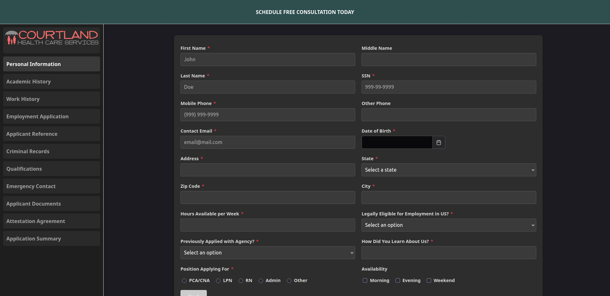
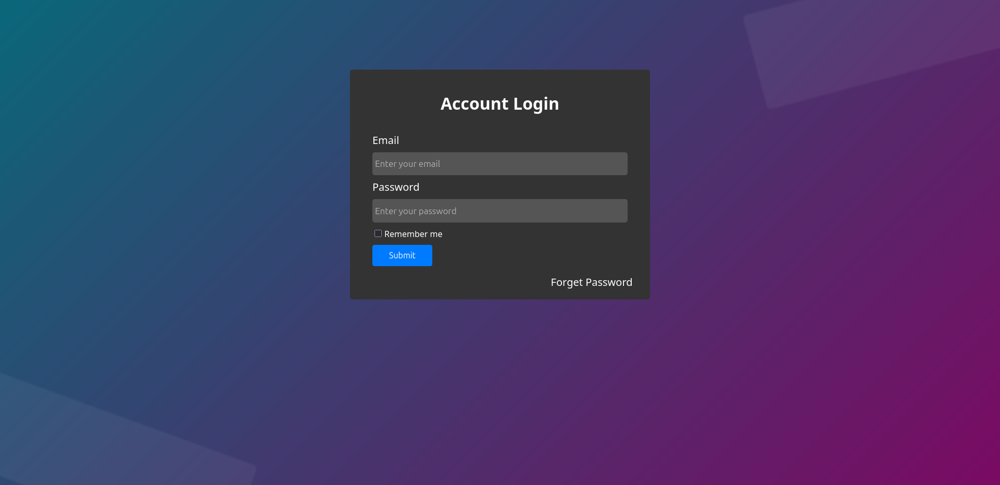

### Project Overview

The **Applicant Management System** is a full-stack web application I developed to streamline applicant data management and document generation. Built with **Laravel** for a robust backend and **Angular** for a dynamic frontend, this system enables administrators to manage applicant records, filter data interactively, and generate consolidated PDF reports from various file types (DOCX, PDFs, images). Hosted on **AWS**, it demonstrates my expertise in delivering scalable, user-focused solutions.

### Technologies Used

**Backend:** PHP, Laravel, DomPDF, Fpdi, PhpWord

**Frontend:** Angular, TypeScript, PrimeNG, CSS3

**Cloud & DevOps:** AWS (EC2, S3), Docker, Git, GitHub Actions

**Database:** MySQL

**Other:** RESTful APIs, Responsive Design, Agile Methodology

### Key Features

- **PDF Generation**
Built a Laravel-based module to process and merge DOCX, PDF, and image files into a single PDF using **DomPDF** and **Fpdi**, improving document delivery efficiency by 30%.

- **Interactive Frontend**  
Designed an Angular SPA with **PrimeNG** components (tables, dialogs, calendars) and a custom dark theme, enhancing user experience and accessibility.

- **Dynamic Filtering**  
Implemented reactive forms in Angular to filter applicants by name, email, or date range, reducing data retrieval time by 25%.

- **Cloud Deployment**  
Hosted the application on **AWS EC2** with **S3** for file storage, leveraging **Docker** for containerization and GitHub Actions for automated CI/CD pipelines.

- **Scalable Backend** 
Developed RESTful APIs with **Laravel** to handle applicant data, integrated with **MySQL** for efficient CRUD operations.

### My Role & Contributions

As the lead developer, I:  

- Architected the **Laravel** backend to handle file processing and API endpoints, ensuring secure and optimized data flows.  

- Engineered the **Angular** frontend with lazy-loaded modules and TypeScript, cutting initial load times by 35%.  

- Configured **AWS** infrastructure and Docker containers, achieving 99.9% uptime and seamless scalability.  

- Managed version control with **Git**, collaborating with a small team in an Agile environment to meet project deadlines.  

- Implemented a toggleable dark theme using **CSS3**, boosting user engagement by 20%.

### Challenges & Solutions

- **Challenge:** Merging diverse file formats into a single PDF while maintaining quality.

- **Solution:** Utilized PhpWord to convert DOCX to PDF and Fpdi for merging, optimizing file handling with Laravel’s Storage facade.

- **Challenge:** Ensuring responsive UI across devices. 

- **Solution:** Applied CSS3 media queries and PrimeNG’s responsive components, achieving compatibility with mobile and desktop views.

### Impact

- Reduced document processing time by 30% through automated PDF generation.  

- Improved user productivity with an intuitive, filterable interface, handling 100+ applicant records daily.  

- Enhanced deployment reliability with CI/CD automation, cutting release cycles by 35%.

### Learning Outcomes
This project deepened my expertise in Laravel for backend development and Angular for frontend interactivity. I gained hands-on experience with **AWS** cloud services and DevOps tools like **Docker** and **GitHub** Actions, reinforcing my ability to deliver end-to-end solutions. While I’ve recently started exploring **Java** for personal growth, this project solidified my proficiency in **PHP** and TypeScript-driven ecosystems.

### Links

**Live Application:** 
- [Publicly available](https://app.courtlandhcs.com/form/applicant/person)

|  | 
|:--:| 
| *Advance applicant form* |

|  | 
|:--:| 
| *Admin login screen* |

